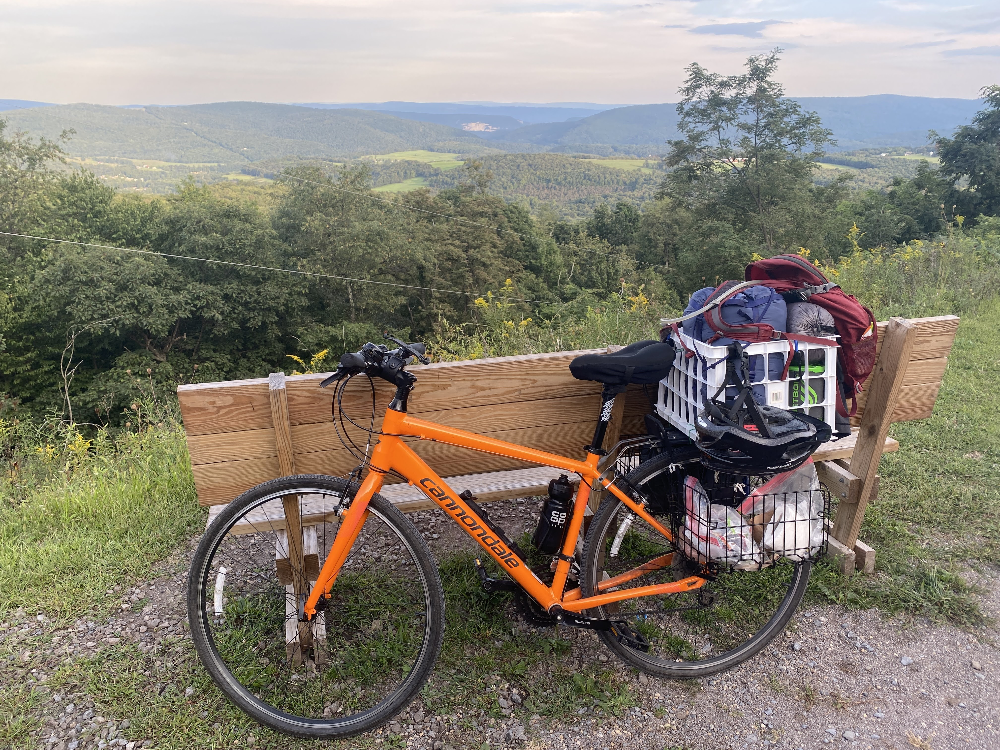

## Nicky Wakim (she/her)

```{r setup, include=FALSE}
library(here)
source(here("class_dates.R"))

library(tidyverse)
```

```{css}
#| echo: false

<style>
#wrap { width: 600px; height: 390px; padding: 0; overflow: hidden; }
#frame { width: 1300px; height: 600px; border: 1px solid black; }
#frame { zoom: 1.5; -moz-transform: scale(1.5); -moz-transform-origin: 0 0; }
</style>
```

::::::: columns
::: {.column width="45%"}
-   **Call me "Nicky," "Dr. W," "Professor Wakim," or any combo!**

-   Assistant Professor of Biostatistics

     

-   Grew up in DC area (Virginia side!)

-   Moved here from Michigan around 2 years ago

-   Two sweet kitties

-   Volleyball, pickleball, ceramics, strolling around my neighborhood

-   But also sleeping, TV, and reading

-   Proud plant mamma

-   *A few other things about myself that I will share non-publicly*
:::

::: {.column width="5%"}
:::

::: {.column width="25%"}
{width="450"} {width="450"} {width="450"}
:::

::: {.column width="25%"}
{width="450"}
:::
:::::::

## Some important tasks

-   Star the class website: <https://nwakim.github.io/EPI_525_25F/>

 

-   Complete Homework 0 by this Thursday at 11pm!

    -   Includes some items above
    -   Think about what day of the week you would like your homeworks due

 

-   Highly suggest that you make an appointment with a learning specialist through [Student Academic Success Center](https://sakai.ohsu.edu/portal/site/Student_Support)!

## Let's visit the website: Homepage

```{=html}
<iframe id="frame" src="https://nwakim.github.io/EPI_525_25F/"></iframe>
```

## Let's visit the website: Syllabus

-   Course learning objectives
-   Textbook in shared folder!
-   R: we will start to learn this programming language
-   Assessments and grade breakdowns
    - Mostly homework + quizzes
-   Feedback from you to me: in the form of exit tickets, midterm feedback, and final course
-   How to succeed in this course: resources and assignments explained
-   Late work policy / Attendance policy
-   ChatGPT and other AI technology
-   Course expectations: a few ways that I will show you respect and commitment to you as students
    -   And a few ways I expect from you!
-   Communicating with me: give me 24 hours to reply M-F
    -   Online communication is not my strength!

## Let's visit the website: Syllabus (2/2)

```{=html}
<iframe id="frame" src="https://nwakim.github.io/EPI_525_25F/syllabus.html"></iframe>
```

## A potential decision

- This class will have recordings

 

- Questions to ask yourself when deciding to attend in person vs. online
  - Can you *learn the lecture content just as well online*?
  - Do you *benefit from in-person learning*? Does it align with your learning style?
  - What is *your experience* in-person vs. online?
  - Do you *engage with the content differently* in-person vs. online?
  - Does *peer interaction add value* to your experience?
  - Is it important to *develop a relationship with your professors*?

 

- We will vote on attendance policies in HW 0

## Let's visit the website: Schedule (1/2)

-   Weeks, class info, homeworks, labs

```{=html}
<iframe id="frame" src="https://nwakim.github.io/EPI_525_25F/schedule.html"></iframe>
```

## Let's visit the website: Schedule (2/2)

|  |  |  |
|:----------------------------|:-------------|:-----------------------------|
| [[](lessons/01_Outcomes_Events_Sample/01_Outcomes_Events_Sample_key_info.qmd)]{style="color:#f8f5f0;"} | Key Info | I will post announcements and other important class related info here. For example, if I change a due date or discuss a common mistake in homework, I will put it here. |
| [[](lessons/17_Negative_binomial_rv/17_Negative_binomial_rv.qmd)]{style="color:#f8f5f0;"} | Slides HTML | These are the basic slides that will open in your browser. |
| [[](lessons/01_Outcomes_Events_Sample/01_Outcomes_Events_Sample.pdf)]{style="color:#f8f5f0;"} | Slides PDF | These are the slides in pdf form for easy note taking. I'm not always the best at posting these before class, so make sure you know how to save your own copy of pdf slides! |
| [[](lessons/01_Outcomes_Events_Sample/01_Outcomes_Events_Sample_notes.pdf)]{style="color:#f8f5f0;"} | Slides Notes | These are the annotated slides in pdf form. In class, I add my own notes to slides. After class, I will post them here. |
| [[](https://forms.office.com/Pages/ResponsePage.aspx?id=V3lz4rj6fk2U9pvWr59xWFMopmPUjRt)]{style="color:#f8f5f0;"} | Exit tix | These are links to that day's exit ticket. |
| [[](mothing)]{style="color:#f8f5f0;"} | Recording | I record our classes. This will be a link to the OneDrive folder containing this recording. |
| [[](lessons/01_Outcomes_Events_Sample/01_Outcomes_Events_Sample_muddy_points.qmd)]{style="color:#f8f5f0;"} | Muddy Points | You will have a chance to ask questions about class in your exit tickets. If I notice a trend in confusion, I will add explanations to these "Muddy Points" |

## Let's visit the website: Search

```{=html}
<iframe id="frame" src="https://nwakim.github.io/EPI_525_25F/schedule.html"></iframe>
```

## Let's visit the website: Homework!

```{=html}
<iframe id="frame" src="https://nwakim.github.io/EPI_525_25F/homework.html"></iframe>
```

## Decision on Homework due dates

-   I have some set due dates in the schedule

-   Please look at your other classes, your calendar, etc

-   Consider what day of the week you would like to turn in your assignments

-   Question in HW 0 to cast your vote and share your opinion

## Structure for this course

-   Learning the basic tools to understand statistics

 

-   It is going to feel useless at times, but I swear it is not!

 

-   This class will help you build a toolbox that allows you to analyze data while understanding the inner theory at play

## What we will cover

{fig-align="center"}

## Let me know if you have questions

Or if there's any contradicting information in the course site... I'm sure I made a mistake somewhere!!
