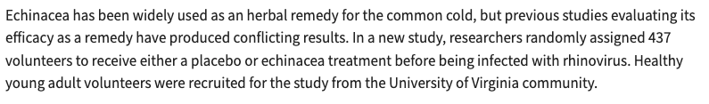

## Announcements

-   Homework 1 feedback
    -   Question 1.12:
        -   population of interest vs. sample population
            -   target population: healthy young adults
            -   sample population: healthy young adults at a University of Virginia
            -   Slightly confusing example - mostly linked to original claim
        -   generalizability
        -   establishing causal relationships
    -   Question 1.8:
        -   age: numeric value
            -   Yes, technically only whole numbers, but it is not really a count
            -   Because so many possible ages, we treat as continuous
-   Quiz 1 info

## Key Dates

-   Homework 3 Assignment due this Sunday at 11pm!
-   Quiz 1 will open Wednesday after class
