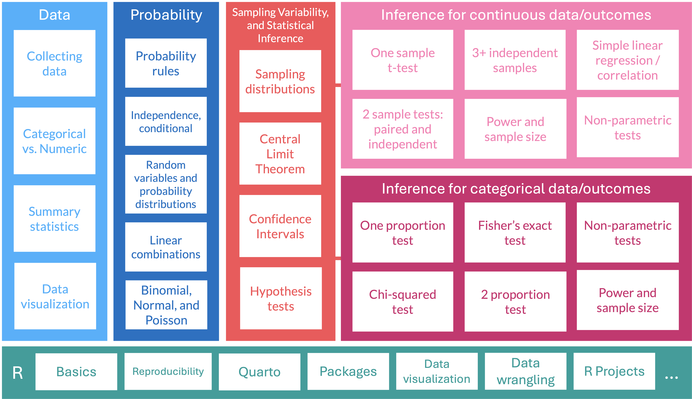
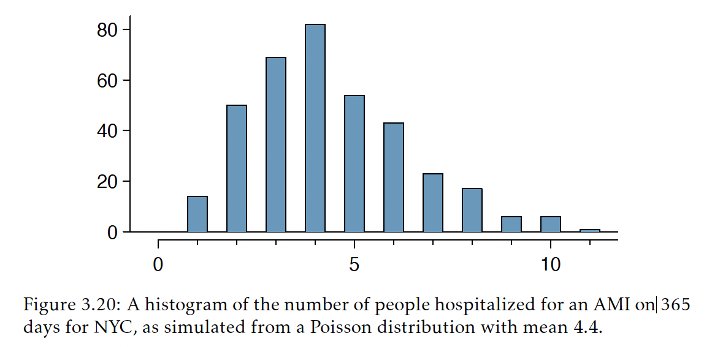

```{r}
#| label: "setup" 
#| include: false
#| message: false
#| warning: false

library(tidyverse)
library(lubridate)
library(janitor)
library(here)
library(knitr)

# terminal: for icons
# quarto install extension quarto-ext/fontawesome

# set ggplot theme for slides 
theme_set(theme_bw(base_size = 22))
theme_update(plot.title = element_text(size = 22, hjust = 0.5))
knitr::opts_chunk$set(warning=FALSE, message=FALSE)

source(here("class_dates.R"))
source(here("lessons", "slides_color_palette.R"))
```

# Learning Objectives

1.  Calculate probabilities for different events using a Poisson
    distribution

## Where are we?

{fig-align="center"}

## Introduction to the Poisson distribution

-   The Poisson distribution is often used to model **count data (# of
    successes)**, especially for **rare events**

    -   It is a **discrete distribution!**

 

-   It is used most often in settings where **events happen at a rate**
    $\lambda$ per unit of population and per unit time

::: columns
::: {.column width="50%"}
-   **Example:** historical records of hospitalizations in New York City indicate that an average of 4.4 people are hospitalized each day for an acute myocardial infarction (AMI)

    - We can plot the distribution of hospitalizations on each day

 
    
:::

::: {.column width="50%"}

:::
:::

## Poisson distribution

-   Suppose events occur over time in such a way that

    1.  The probability an event occurs in an interval is proportional
        to the length of the interval.

    2.  Events occur independently at a rate $\lambda$ per unit of time.

-   Then the probability of exactly $x$ events in one unit of time is $$
    P(X = k) = \frac{e^{-\lambda}\lambda^{k}}{k!}, \,\, k = 0, 1, 2,
    \ldots
    $$

-   For the Poisson distribution modeling the number of events in one
    unit of time:

    -   The mean is $\lambda$.

    -   The standard deviation is $\sqrt{\lambda}$.

-   Shorthand for a random variable, $X$, that has a Poisson
    distribution: $$X \sim \text{Pois}(\lambda)$$

## Poisson distribution: R commands

R commands with their [input]{style="color:#BF396F"} and
[output]{style="color:#367B79"}:

::: columns
::: column

+----------------+-----------------------------------------------+
| R code         | What does it return?                          |
+================+===============================================+
| `rpois()`      | returns [sample of random                     |
|                | variables]{style="color:#367B79"} with        |
|                | [specified Poisson                            |
|                | distribution]{style="color:#BF396F"}          |
+----------------+-----------------------------------------------+
| `dpois()`      | returns [value of probability                 |
|                | density]{style="color:#367B79"} at [certain   |
|                | point of the Poisson                          |
|                | distribution]{style="color:#BF396F"}          |
+----------------+-----------------------------------------------+
| `ppois()`      | returns [cumulative                           |
|                | probability]{style="color:#367B79"} of        |
|                | getting [certain point (or less) of the       |
|                | Poisson distribution]{style="color:#BF396F"}  |
+----------------+-----------------------------------------------+
| `qpois()`      | returns [number of                            |
|                | cases]{style="color:#367B79"} corresponding  |
|                | to [desired quantile]{style="color:#BF396F"}  |
+----------------+-----------------------------------------------+

:::
::: column
:::
:::

## Example: probabilities from a Poisson distribution (1/4)

::: example
::: ex-ttl
Typhoid fever
:::
::: ex-cont
::: columns
::: column
Suppose there are on average 5 deaths
per year from typhoid fever over a 1-year period.

1.  What is the probability of 3 deaths in a year?

2.  What is the probability of 2 deaths in 0.5 years?

3.  What is the probability of more than 12 deaths in 2 years?
:::
::: column
```{r}
#| echo: false
#| message: false
#| fig-height: 4
#| fig-width: 7

library(tidyverse)

x <- 0:250
lambda = 5

pois = expand.grid(x = x, lambda = lambda) %>%
  mutate(y = dpois(x, lambda = lambda))

ggplot(pois %>% filter(y > 1e-5), 
       aes(x, y)) +
  geom_point(size=1) +
  geom_segment(aes(x=x, xend=x, y=0, yend=y), lwd=0.8, alpha=0.5) +
  theme(legend.position = "none",
        axis.title = element_text(size = 22),    # Axis title size
        axis.text = element_text(size = 22),     # Axis text size
        strip.text = element_text(size = 22), 
        title = element_text(size = 22)) +  # Facet label size
  labs(x = "Number of successes (x)", y = "Probability, P(x)", 
       title = "Poisson distribution with lambda of 5") +
  scale_color_manual(values = palette_525)
```
:::
:::
:::
:::

## Example: probabilities from a Poisson distribution (2/4)

::: example
::: ex-ttl
Typhoid fever
:::
::: ex-cont
Suppose there are on average 5 deaths
per year from typhoid fever over a 1-year period.

1.  What is the probability of 3 deaths in a year?
:::
:::

- $\lambda = 5$ and we want $P(X = 3)$

$$P(X=3) = \frac{e^{-5}5^{3}}{3!} = 0.1404$$

```{r}
dpois(x = 3, lambda = 5)
```

## Example: probabilities from a Poisson distribution (3/4)

::: example
::: ex-ttl
Typhoid fever
:::
::: ex-cont
Suppose there are on average 5 deaths
per year from typhoid fever over a 1-year period.

2.  What is the probability of 2 deaths in 0.5 years?

:::
:::

$\lambda = ?$ and we want $P(X = 2)$

- $\lambda=5$ was the rate for one year. When we want the rate for half year, we need to calculate a new $\lambda$: 

    - $\lambda = \dfrac{5 \text{ deaths}}{1 \text{ year}}\cdot\dfrac{1 \text{ year}}{2 \text{ half-years}}=\dfrac{2.5 \text{ deaths}}{1 \text{ half-year}}$

$$P(X=2) = \frac{e^{-2.5}2.5^{2}}{2!} = 0.0.2565$$

```{r}
dpois(x = 2, lambda = 2.5)
```

## Example: probabilities from a Poisson distribution (4/4)

::: example
::: ex-ttl
Typhoid fever
:::
::: ex-cont
Suppose there are on average 5 deaths
per year from typhoid fever over a 1-year period.

3.  What is the probability of more than 12 deaths in 2 years?
:::
:::

$\lambda = ?$ and we want $P(X > 12)$

- Need to calculate a new $\lambda$ for 2 years: $\lambda = \dfrac{5 \text{ deaths}}{1 \text{ year}}\cdot\dfrac{2 \text{ years}}{1 \text{ two-years}}=\dfrac{10 \text{ deaths}}{1 \text{ two-year}}=\dfrac{10 \text{ deaths}}{2 \text{ years}}$

$$P(X>12) = 1 - P(X \leq 12) = 1 - \sum_{k=0}^{12}\frac{e^{-10}10^{k}}{k!} = 0.2084$$

::: columns
::: column
```{r}
1 - ppois(q = 12, lambda = 10)
```
:::

::: column
```{r}
ppois(q = 12, lambda = 10, 
      lower.tail = F)
```
:::
:::


## Poisson approximation of binomial distribution

-   Poisson distribution can be used to approximate binomial distribution when $n$ is large and
    $p$ is small
    -   When Normal approximation does not work

-   Binomial distributions for different $n$ (columns) and $p$ (rows)

```{r}
#| echo: false
#| message: false
#| fig-height: 4
#| fig-width: 10

library(tidyverse)

x <- 0:250
n = c(60,100,200,400)
p = c(0.005, 0.02)

binom = expand.grid(x = x, n = n, p = p) %>%
  mutate(y = dbinom(x, size = n, prob = p))

ggplot(binom %>% filter(y > 1e-5) %>% 
         group_by(n), 
       aes(x, y, color=factor(n))) +
  geom_point(size=1) +
  geom_segment(aes(x=x, xend=x, y=0, yend=y, color=factor(n)), lwd=0.8, alpha=0.5) +
  facet_grid(rows = vars(p), cols = vars(n), scales="free_x", space="free_x", 
             labeller = \(x) label_both(x, sep = "=")) +
  theme(legend.position = "none",
        axis.title = element_text(size = 14),    # Axis title size
        axis.text = element_text(size = 12),     # Axis text size
        strip.text = element_text(size = 13)) +  # Facet label size
  labs(x = "Number of successes", y = "Probability") +
  scale_color_manual(values = palette_525)
```
